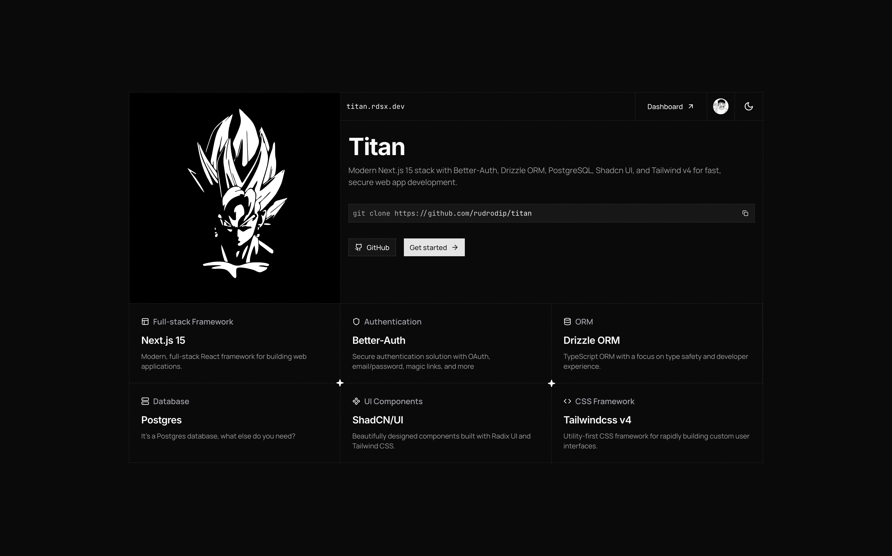

# Titan

Next.js 15 fullstack template with better-auth for authentication and drizzle-orm as the ORM.



> [!WARNING]
> This project uses Next.js 15-canary to support node runtime on middleware. This is not yet supported in stable version.

## Tech Stack

- Full-stack framework: Next.js 15-canary
- UI: Tailwind CSS v4
- Component library: Shadcn UI
- Authentication: better-auth
- Database: postgres
- ORM: drizzle-orm

## Features

- Authentication
  - Social login
    - Google
    - Github
    - Discord
- Database
  - Postgres (Neon)
  - ORM: drizzle-orm
- Next.js API, server actions, and middleware

## Getting Started

1. Clone the repository

```bash
git clone https://github.com/rudrodip/titan.git
```

2. Install dependencies

```bash
bun install
```

3. Create environment file

```bash
cp .env.example .env
```

4. Generate database schema

```bash
bun run db:generate
```

5. Migrate database

```bash
bun run db:migrate
```

6. Run the development server

```bash
bun dev
```

7. Open the browser and navigate to `http://localhost:3000`
