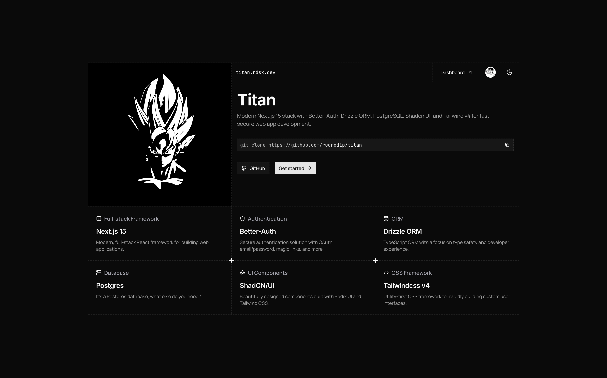

# Titan

Next.js 15 fullstack template with better-auth for authentication and drizzle-orm as the ORM.



> [!WARNING]
> This project uses Next.js 15-canary to support node runtime on middleware. This is not yet supported in stable version.

## Tech Stack

- Full-stack framework: Next.js 15-canary
- UI: Tailwind CSS v4
- Component library: Shadcn UI
- Authentication: better-auth
- Database: postgres
- ORM: drizzle-orm

## Features

- Authentication
  - Social login
    - Google
    - Github
    - Discord
- Database
  - Postgres (Neon)
  - ORM: drizzle-orm
- Next.js API, server actions, and middleware

## Getting Started

1. Clone the repository

```bash
git clone https://github.com/rudrodip/titan.git
```

2. Install dependencies

```bash
bun install
```

3. Start PostgreSQL and create the local environment file

```bash
docker compose up -d
cp .env.example .env
```

Set `BETTER_AUTH_SECRET` in `.env` to a random secret (for example, run `openssl rand -base64 32`). `BETTER_AUTH_URL` is the local app URL, and `DATABASE_URL` uses the PostgreSQL username, password, database, and host port from `docker-compose.yml` (`postgres`, `postgres`, `titan`, and `5436`). The GitHub and Google client IDs and secrets are optional; to enable either provider, fill in both values and register `http://localhost:3000/api/auth/callback/github` or `http://localhost:3000/api/auth/callback/google` as its OAuth callback URL.

4. Apply the included database migration

```bash
bun run db:migrate
```

5. Run the development server

```bash
bun dev
```

6. Open the browser and navigate to `http://localhost:3000`
